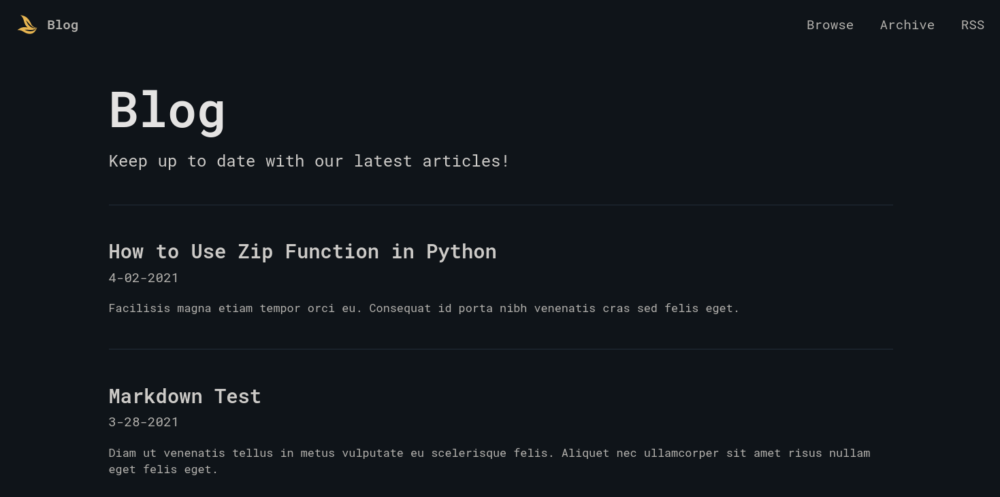

# Ayu Blog Template

A comfy ayu-themed blog template built with Next JS + Tailwind CSS and utilizes MDX for the data, allowing for a combination of React and Markdown. All blog articles can be contributed through git.

This was built in order to allow individuals to quickly get a blog platform up and running, while simultaneously allowing for a great amount of customizability with Next JS.

